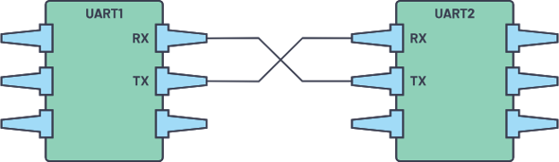
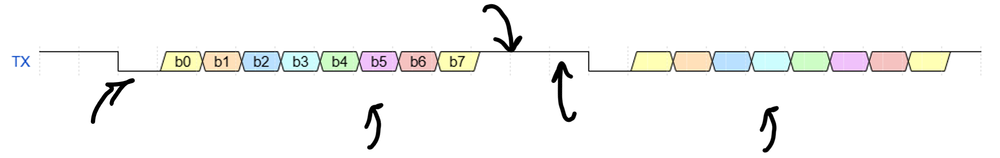
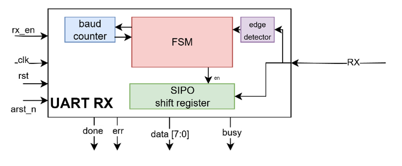

# UART Project Documentation

## Project Overview
This is a comprehensive UART (Universal Asynchronous Receiver/Transmitter) design project developed as part of the NTI Verilog Course. It implements a memory-mapped UART peripheral with independent TX/RX datapaths, configurable baud rate, and a simple control/status register interface.

## Physical Connection

Two UART devices connect with a crossover between TX and RX: device A's TX drives device B's RX, and device B's TX drives device A's RX. Each side runs its own independent transmitter and receiver logic — there's no shared clock line; both ends must be configured to the same baud rate ahead of time.



## Frame Format (8-N-1)

Each byte is sent as:
- **1 start bit** — line pulled low (0), used by the receiver to detect the beginning of a frame
- **8 data bits** — sent **LSB first**
- **No parity bit**
- **1 stop bit** — line high (1)

The line idles high (1) between frames. At 9600 baud, one bit period ≈ 104.167 µs (1/9600).



## Directory Structure

```
UART/
├── rtl/                   # RTL Source Files
│   ├── uart_top.v         # Top-level UART module
│   ├── uart_tx.v          # UART Transmitter module
│   └── uart_rx.v          # UART Receiver module
├── tb/                    # Design Verification
│   ├── uart_tx_tb.v       # UART Transmitter testbench
│   └── uart_rx_tb.v       # UART Receiver testbench
└── images/                # Images
    ├── UART_Conection.png
    ├── UART_Frame_timing.png
    └── UART_RX_architecture.png
```

## RTL Design Components

### 1. UART Top Module (`uart_top.v`)
- **Purpose**: Top-level integration of UART transmitter, receiver, and the register interface
- **Features**:
  - Clock and reset management
  - Separate TX and RX datapaths
  - Configurable baud rate via the `BAUDIV` register
  - Memory-mapped register space for control/status/data (see Register Map below)
- **I/O Ports**:
  - System clock and asynchronous reset
  - UART TX/RX serial lines
  - Register read/write interface, status and control signals

### 2. UART Transmitter (`uart_tx.v`)
- **Purpose**: Serial data transmission with UART protocol
- **Features**:
  - 8-bit data transmission, LSB first
  - Configurable baud rate
  - Start bit + 8 data bits + stop bit framing
  - `tx_busy` while sending, `tx_done` once the loaded byte has finished
  - Synchronous and asynchronous reset support
- **Architecture** (per suggested TX design):
  - **Baud counter**: generates the bit-time tick based on the target baud rate (e.g. 9600) and system clock (100 MHz)
  - **Bit select**: tracks which bit (start/data0–7/stop) is currently being sent and holds it on the TX line for one full bit period
  - **Control FSM**: sequences bit-select/baud-counter and drives `busy`/`done`

### 3. UART Receiver (`uart_rx.v`)
- **Purpose**: Serial data reception with UART protocol
- **Features**:
  - 8-bit data reception, LSB first
  - Start-bit detection via falling-edge trigger
  - Mid-bit sampling for noise immunity
  - Framing error detection (`err`) if the stop bit is invalid
  - Configurable baud rate


- **Architecture** (per suggested RX design — 4 blocks):
  - **Edge detector**: catches the idle→low transition on RX caused by the start bit
  - **Baud counter**: a down-counter; the FSM sets its load value and reads a zero-flag from it to time each bit
  - **SIPO shift register**: enabled by the FSM, samples the RX line each time it's enabled (i.e. at the sampling instant of each bit)
  - **RX FSM**: loads the baud counter and waits for it to reach zero, drives the SIPO enable to sample bits at the correct time, and tracks how many bits have been sampled
- **RX sampling timing** (per the state diagram):
  1. On detecting the start edge, wait **1.5 bit periods** before the first SIPO sample (this centers the sample in the middle of the start bit)
  2. Wait **1 bit period** between each subsequent sample, sampling data bits 0–7 in the middle of their bit windows
  3. Track the number of bits sampled; after 8 data bits, check the stop bit
  4. Assert `err` if a framing error is detected (stop bit not at expected logic level)
  5. Assert `done` once a valid byte has been received; `busy` is asserted for the duration of the frame

## Verification Environment

### Testbenches
1. **uart_tx_tb.v**: Testbench for UART transmitter
   - Tests normal transmission
   - Tests reset functionality
   - Tests various data patterns
   - Includes timing verification against the expected bit period

2. **uart_rx_tb.v**: Testbench for UART receiver
   - Tests normal reception
   - Tests frame error detection (bad stop bit)
   - Tests various data patterns
   - *(Extend here with any additional coverage you've actually implemented, e.g. glitch rejection or overrun handling — these are not part of the base spec, so call them out explicitly as extensions if present)*

## Register Map

All registers are 32-bit, word-addressed:

| Address | Register Name | Description |
|---------|---------------|-------------|
| 0x0000  | CTRL_REG      | `tx_en`, `rx_en`, `tx_rst`, `rx_rst` |
| 0x0001  | STATS_REG     | `rx_busy`, `tx_busy`, `rx_done`, `tx_done`, `rx_error` |
| 0x0002  | TX_DATA       | UART TX data (byte to transmit) |
| 0x0003  | RX_DATA       | UART RX data (last byte received) |
| 0x0004  | BAUDIV        | Variable baud rate divider **[BONUS]** |

> Note: addresses above are register **indices** (word addresses), not byte offsets. If your register interface is byte-addressable (e.g. an APB/AXI-Lite bus), multiply by 4 to get byte offsets — but confirm which convention your top module actually implements before treating these as byte offsets.

## Operation Sequence

**Before every transmission and after every reception**, assert the corresponding soft-reset bit (`tx_rst` for TX, `rx_rst` for RX) in `CTRL_REG`.

**UART TX:**
1. Write the byte to send into `TX_DATA`
2. Assert `tx_en` in `CTRL_REG`
3. Poll `tx_busy`/`tx_done` in `STATS_REG` to track completion

**UART RX:**
1. Assert `rx_en` in `CTRL_REG`
2. Poll `rx_busy`, `rx_done`, and `rx_error` in `STATS_REG`
3. Read the received byte from `RX_DATA` once `rx_done` is set

## Usage Instructions

### Simulation
1. Navigate to the project directory
2. Run ModelSim/QuestaSim simulation:
   ```
   vsim -do run_uart_tx_tb.do
   vsim -do run_uart_rx_tb.do
   ```

## Design Specifications

- **Technology**: Verilog HDL
- **Target Frequency**: 100 MHz
- **Supported Baud Rates**: Configurable via `BAUDIV` (bonus feature)
- **Data Format**: 8-N-1 (8 data bits LSB-first, no parity, 1 stop bit)
- **Reset**: Both synchronous and asynchronous

## File Descriptions

### Source Files
- `uart_top.v`: Top-level UART module with memory-mapped register interface
- `uart_tx.v`: UART transmitter implementation
- `uart_rx.v`: UART receiver implementation

### Verification Files
- `uart_tx_tb.v`: UART transmitter testbench
- `uart_rx_tb.v`: UART receiver testbench

### Documentation
- `README.md`: This documentation file
